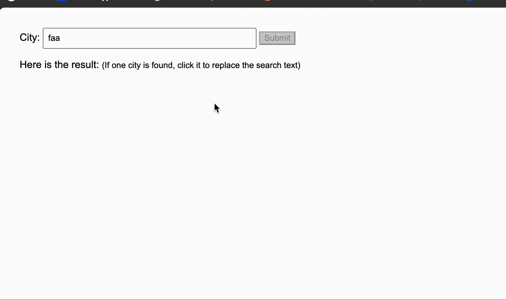

an auto-complete widget on a text &lt;input> with the following requirements:   

# javascript_simpleAutoComplete

[Launch the web app here](http://binghuan.github.io/javascript_simpleAutoComplete/autoComplete.html)

## Project Overview

This project implements a pure JavaScript auto-complete widget for a text `<input>`, featuring:

- **No well-known UI libraries used** – everything is built from scratch.
- **Dataset of 100~1000 entries** – e.g., timezone names from tzdata.
- **Input validation** – users can only submit if their input matches an entry in the dataset.
- **Works locally** – can be loaded from `http://localhost/` or `file:///` without any server-side logic.
- **Efficient and memory-conscious** – designed for performance and low resource usage.
- **Unit-testable and reusable code**.

### References
- [tzdata on Wikipedia](https://en.wikipedia.org/wiki/Tzdata)
- [Mozilla Gaia tz.json example](https://github.com/mozilla-b2g/gaia/blob/master/shared/resources/tz.json)

---

If you are interested in my other works, please visit my blogs:
- http://studiobinghuan.blogspot.tw/
- http://bhtalk.blogspot.com

 
This project was created as a coding quest from Mozilla.

# Demo
